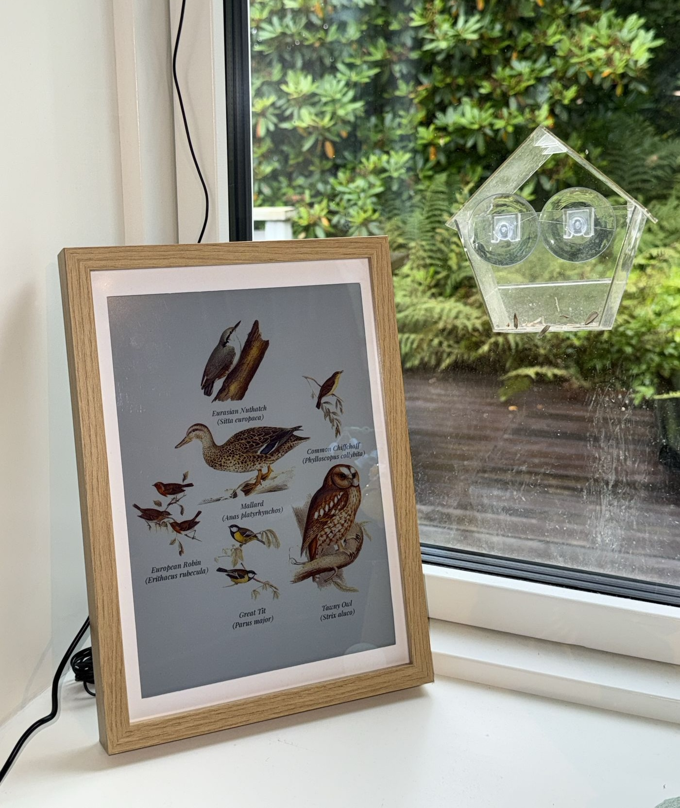

# fugleramme
E-ink bird frame for Raspberry Pi - real-time bird detection by audio, fully local AI, rendered as real, hand-cut 1800s bird illustrations.

<p align="center">
  
  <br>
  <em>Sorry about the dirty window - squirrels have been stealing the bird food.</em>
</p>

<p align="center">
  <a href="https://fugleramme.arnegiacomo.dev"></a>
  <a href="https://github.com/arnegiacomo/fugleramme/releases"></a>
  <a href="https://github.com/arnegiacomo/fugleramme/actions/workflows/ci.yml"></a>
  <a href="https://github.com/arnegiacomo/fugleramme/commits/main"></a>
  <br>
  <a href="https://github.com/arnegiacomo/fugleramme/stargazers"></a>
  <a href="https://github.com/arnegiacomo/fugleramme/graphs/contributors"></a>
  <a href="#license"></a>
  <br>
  <a href="#art"></a>
  <a href="#art"></a>
</p>

> [!NOTE]
> Still in early development: expect the odd bug and a few unpolished edges, with plenty more features to come.

Live on **[fugleramme.arnegiacomo.dev](https://fugleramme.arnegiacomo.dev)** running from my kitchen window and displaying the actual birds currently heard in my garden (Bergen, Norway).

Hardware, install and operations docs: **[arnegiacomo.dev/fugleramme](https://arnegiacomo.dev/fugleramme/)**

## How it works

[BirdNET-Go](https://github.com/tphakala/birdnet-go) listens on a mic and handles the
classifier. Fugleramme polls its api, matches each species to
an illustration, then packs them onto a page, and redraws only when the birds change - on
an [Inky Impression](https://shop.pimoroni.com/discount/ARNE?redirect=/products/inky-impression) e-ink panel, and
as a web kiosk serving the same view. There's an admin page that lets you configure what
to show, and automatic updates and such.

If you already run BirdNET-Go, point the frame at it instead - on the same machine or anywhere else reachable from your network.

> [!TIP]
> The e-ink panel is not required, although it's recommended for the intended experience. Without one, Fugleramme runs web-only - show the
> kiosk on a display over HDMI, or open it from any device on the network.

## Hardware

A Raspberry Pi 5, an [Inky Impression 13.3"](https://shop.pimoroni.com/discount/ARNE?redirect=/products/inky-impression)
(Spectra 6), a mic and an A4 frame. Full parts list, recommendations and alternatives: **[Hardware](docs/hardware.md)**.

I'm affiliated with Pimoroni - buying through the Pimoroni links or using the code `ARNE` at checkout supports this project.

## Art

Half the point of this project is showing off some amazing public-domain natural-history
illustrations. Over 800 cut-outs covering more than 400 species, every one taken from a
real plate and hand-curated for this project (no art is AI-generated, though some has been
retouched with AI).

Each detected species is matched to its illustration, background-removed, and packed onto
a textured paper page with the larger birds toward the centre, sized by body mass. An empty
window shows a bare perch.

The plates are Scandinavian, British and central European, so the Nordics, the British Isles and Germany
are best covered. Elsewhere not so much (yet). Broader European and North American
coverage is in the works!

[Species coverage](https://arnegiacomo.dev/fugleramme/species/) has a searchable list of all currently supported species. See [Adding artwork](docs/adding-artwork.md) for manual cutout steps.

| No detections | A few visitors | A full garden |
| :---: | :---: | :---: |
|  |  |  |

## Inspiration and related projects

The look came from a [WWF Verdens naturfond poster by Axel Thorenfeldt](https://www.axelthorenfeldt.com/news/wwf-verdens-naturfonds-fugleskole)
hanging on my wall, the live-frame idea from [AvianVisitors](https://theodore.net/projects/AvianVisitors/) that I saw on Instagram,
and the detection from [BirdNET-Go](https://github.com/tphakala/birdnet-go) - I wanted a version of that poster showing the actual birds in my garden.

Similar projects:

- [AvianVisitors](https://github.com/Twarner491/AvianVisitors) - BirdNET-Pi, AI-generated illustrations and photo cutouts
- [inky-bird-frame](https://github.com/veteranbv/inky-bird-frame) - BirdNET, field-journal illustrations on an Inky panel
- [HABirdDashboard](https://github.com/adamoberley/HABirdDashboard) - BirdNET-Go, a collage card for Home Assistant
- [belkins-birdnet](https://github.com/Belkins/belkins-birdnet) - BirdNET-Pi, AI-generated kachō-e style illustrations
- [featherframe](https://github.com/wr/featherframe) - BirdNET-Pi, Audubon plates on an ESP32 e-ink panel
- [birdframe](https://github.com/simenf/birdframe) - BirdNET-Go, several art styles on a Samsung Frame TV

Fugleramme shares no code or art with them.

## Run locally (for development)

```bash
uv sync                                       # set up venv
uv run fugleramme-fake-detector               # stand-in BirdNET-Go on :8090
uv run fugleramme-dev                         # start service on :8080 with hot-reload
```

The fake detector's flags, and working against a real station instead:
[Running it without a Pi](CONTRIBUTING.md#running-it-without-a-pi).

## Install on a Raspberry Pi

From the pi (assuming you have the hardware up and running):

```bash
curl -fsSL https://raw.githubusercontent.com/arnegiacomo/fugleramme/main/install.sh | bash
```

Asks where BirdNET-Go should live and which ports to use, clones the repo, installs the required deps, and starts the frame as a systemd service. **NB!** Will probably require a reboot on a fresh system.

From a blank SD card, see the full [install guide](docs/install.md).

## Run in a container

```bash
docker run -d -p 8080:8080 -v fugleramme:/data \
  -e FUGLERAMME_DETECTOR_URL=http://birdnet.local:8080 \
  ghcr.io/arnegiacomo/fugleramme
```

Or build the image from a checkout:

```bash
docker build -t fugleramme .
docker run --rm -p 8080:8080 -v fugleramme:/data \
  -e FUGLERAMME_DETECTOR_URL=http://birdnet.local:8080 fugleramme
```

Kiosk on `:8080`, admin on `:8080/admin`, everything it persists in `/data`.

On a Linux box with a USB mic, this brings up BirdNET-Go alongside it:

```bash
curl -fsSL https://raw.githubusercontent.com/arnegiacomo/fugleramme/main/examples/docker-compose.yml -o docker-compose.yml
docker compose up -d
```

See **[Container](docs/container.md)** for more info.

## Contributing

Contributions are very welcome and encouraged - fixes, docs and artwork most of all. Thanks to
[everyone who has contributed](https://github.com/arnegiacomo/fugleramme/graphs/contributors)
so far ❤️

- **Something is broken** - a [bug report](https://github.com/arnegiacomo/fugleramme/issues/new/choose)
- **A question, an idea, or a frame you have built** - the
  [FAQ](https://arnegiacomo.dev/fugleramme/faq/) first, then
  [Discussions](https://github.com/arnegiacomo/fugleramme/discussions)
- **A fix, a doc change, or a bird you have cut** - open a PR, no issue needed

See **[Contributing](CONTRIBUTING.md)** for more info.

## License

- Code: MIT - see [`LICENSE`](LICENSE).
- Detection ([BirdNET-Go](https://github.com/tphakala/birdnet-go), installed
  separately as a container): CC BY-NC-SA 4.0, non-commercial only. BirdNET model
  by the Cornell Lab of Ornithology and Chemnitz University of Technology,
  taxonomy data powered by eBird.org.
- Bird images: each style folder carries its own terms and sources, and its
  manifest links the plate every file was cut from. `classic` is
  CC BY-SA 4.0 - see
  [`assets/artwork/classic/ATTRIBUTION.md`](assets/artwork/classic/ATTRIBUTION.md).
- Label fonts (`assets/fonts/`): SIL OFL 1.1 - see
  [`assets/fonts/ATTRIBUTION.md`](assets/fonts/ATTRIBUTION.md).
- Bird sizes (`assets/bird_sizes.csv`): body mass from AVONET (Tobias et al.
  2022, Ecology Letters, [doi:10.1111/ele.13898](https://doi.org/10.1111/ele.13898)),
  CC BY 4.0.
- BirdNET scientific-name aliases (`assets/birdnet_aliases.json`):
  [OpenFauna](https://github.com/tphakala/openfauna)'s compiled taxonomic alias
  map, CC BY-SA 4.0 - see [`assets/ATTRIBUTION.md`](assets/ATTRIBUTION.md).
- Docs search (`docs/assets/fuse.min.js`): [Fuse.js](https://www.fusejs.io/) by
  Kiro Risk, Apache 2.0.

## Contact

Questions and ideas about the project belong in
[Discussions](https://github.com/arnegiacomo/fugleramme/discussions). For anything
else, you can reach me through [arnegiacomo.dev](https://arnegiacomo.dev/). I've built
a few of these frames, but I currently don't have the capacity to build them for others.
