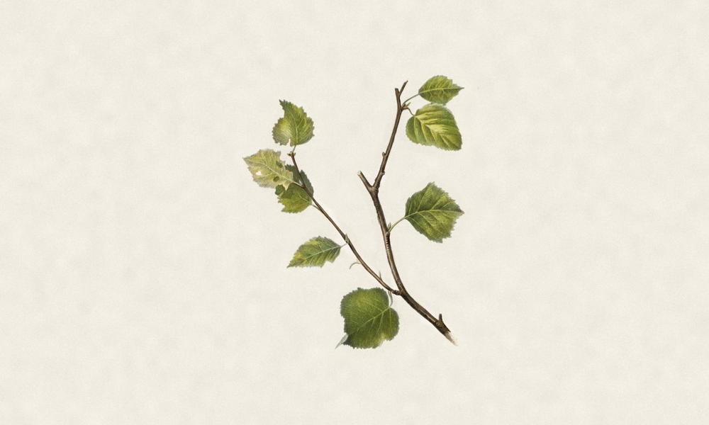
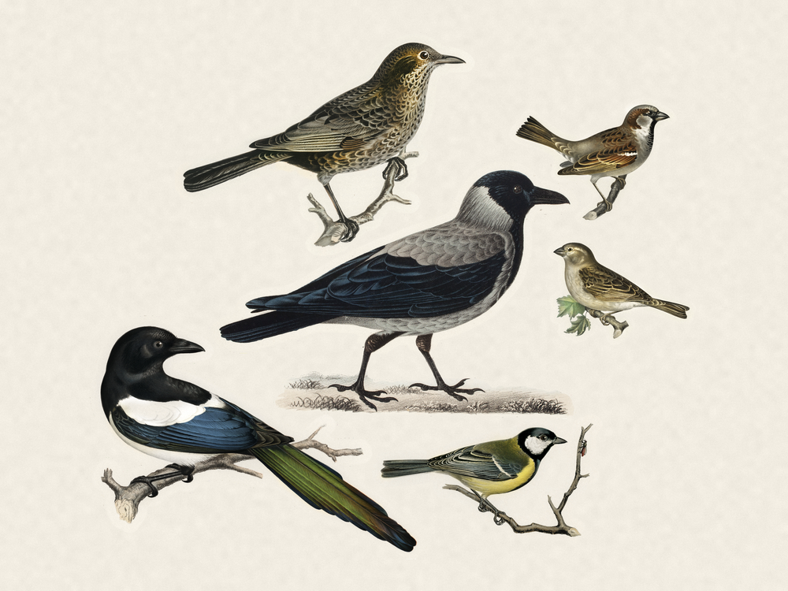
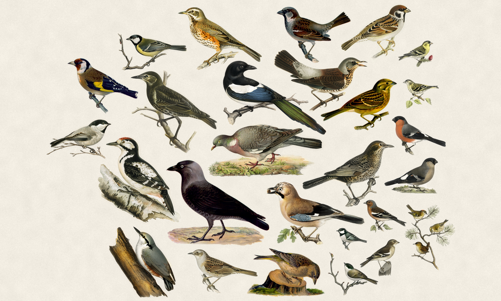

# fugleramme
E-ink bird frame for Raspberry Pi - real-time bird detection by audio.

Built on top of [BirdNET-Go](https://github.com/tphakala/birdnet-go), which handles
the mic, the BirdNET classifier and the detection settings. Fugleramme reads
the detections and renders recently-seen birds on an [Inky-Impression](https://shop.pimoroni.com/products/inky-impression) e-ink panel.

> [!TIP]
> The e-ink panel is not required, although its recommended for the inteded experience. Without one, Fugleramme runs web-only - show the
> kiosk on a display over HDMI, or open it from any device on the network.

Hardware, install and operations docs: **[arnegiacomo.dev/fugleramme](https://arnegiacomo.dev/fugleramme/)**

## Art

(WIP)

The birds are cut-outs from historic, public-domain natural-history drawings,
hand-curated for this project. Each detected species is matched to its
illustration, background-removed, and packed onto a textured paper page - larger
birds toward the centre, sized by real body mass. Species with no illustration
are currently left off, and an empty window shows a bare perch.

| No detections | A few visitors | A full garden |
| :---: | :---: | :---: |
|  |  |  |

## Run locally (for development)

```bash
uv sync                                       # set up venv
uv run python -m fugleramme.seed --count 40   # seed db (no BirdNET-Go in dev)
uv run fugleramme-dev                         # start service on :8080 with hot-reload
```

## Install on a Raspberry Pi

From the pi (assuming you have the hardware up and running):

```bash
curl -fsSL https://raw.githubusercontent.com/arnegiacomo/fugleramme/main/install.sh | bash
```

Clones the repo, installs the required deps, starts BirdNET-Go and starts the frame as a systemd service. **NB!** Will probably require a reboot on a fresh system.

If the display
stays blank after that, see
[Troubleshooting](docs/troubleshooting.md#panel-stays-blank).

From a blank SD card, see the full [install guide](docs/install.md).

## Prebuilt frames

I've built a few of these. If you'd like one rather than building it yourself,
please [get in touch](https://arnegiacomo.dev/).

## License

- Code: MIT - see [`LICENSE`](LICENSE).
- Detection ([BirdNET-Go](https://github.com/tphakala/birdnet-go), installed
  separately as a container): CC BY-NC-SA 4.0, non-commercial only. BirdNET model
  by the Cornell Lab of Ornithology and Chemnitz University of Technology,
  taxonomy data powered by eBird.org.
- Bird images: each style folder carries its own terms and sources, and every
  file names the plate it was cut from in its PNG metadata. `classic` is
  CC BY-SA 4.0 - see
  [`assets/birds/classic/ATTRIBUTION.md`](assets/birds/classic/ATTRIBUTION.md).
- Label fonts (`assets/fonts/`): SIL OFL 1.1 - see
  [`assets/fonts/ATTRIBUTION.md`](assets/fonts/ATTRIBUTION.md).
- Bird sizes (`assets/bird_sizes.csv`): body mass from AVONET (Tobias et al.
  2022, Ecology Letters, [doi:10.1111/ele.13898](https://doi.org/10.1111/ele.13898)),
  CC BY 4.0.
