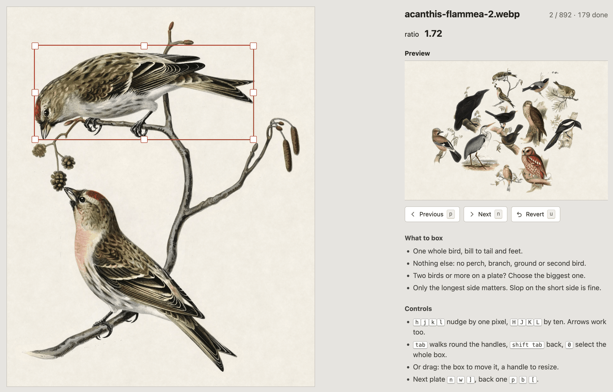

# Adding artwork

## Find what is missing

The admin page's Detector tab counts every bird your station has heard without art, and opens a Missing bird issue
with the list pre-filled or copies it. If you like logs: `journalctl -u fugleramme-frame | grep "No artwork"` lists the ones it skipped recently.

## Source an image

Wikimedia Commons is a good place to find public domain artwork. Search for the scientific
name followed by "illustrations", for example [Streptopelia decaocto illustrations](https://commons.wikimedia.org/w/index.php?search=Streptopelia+decaocto+illustrations&title=Special%3AMediaSearch&type=image).

Choose public-domain or openly licensed artwork whose terms are compatible with
the style. Keep the artist or work name, licence, and link to the original image
for its manifest and `ATTRIBUTION.md` entries.

Grab the highest resolution version of the scan you can find. Once cut out, the bird should be at least 600 px tall or wide, otherwise it'll look ugly when the frame shows it in a single-bird mode.

## Prepare the image

Krita is my preferred manual tool of choice here (it's free and easy to use)

### Cut out the bird

Use the Polygonal Selection Tool with anti-aliasing enabled.

Select the bird or the excess. Invert the selection if necessary, then delete
the background.

Where a branch or stem (or other object) runs out of the cut, either fade it into the paper or cut it round so that it looks natural. A flat cut can be jarring.

You don't have to cut a single bird free. A pair on one branch, or the whole plate with its plants and ground, is welcome - the [bird box](#box-the-bird) keeps the bird itself at the right size.

### Match the colour

Old scans are often faded, yellowed or washed out. If your bird looks washed out next to the birds already in the set, raise the saturation or contrast so it doesn't get overshadowed. Every bird should look like they're printed with the same strength.

### Add the halo

The ring of paper around the bird helps us blend it to the page. The frame retones it to the sheet's own colour and feathers its edge, so the join disappears instead of reading as a cut-out pasted on. It also allows for less precise cutouts, backgrounds between legs or behind feathers, and gives some natural spacing.

Scan-paper left inside the outline, like between the legs or under the tail, has to match the halo's colour. Either cut it out, or re-tone the paper and the halo to each other.

Use **Image > Flatten Image** first.

1. Set the foreground colour to `#F0ECE5`.
2. Use **Select > Select Opaque**.
3. Use **Select > Grow Selection...** with a radius of about 18 px, depending on the image size.
4. Use **Layer > New > Paint Layer**, then drag the layer below the bird.
5. Use **Edit > Fill with Foreground Color**.
6. Use **Select > Deselect**, then **Image > Flatten Image**.
7. Export as PNG and tick **Store alpha channel**.

### Or try to let an agent cut it

If you use Claude Code, the repo ships a `plate-review` skill that does the cutting and the halo from a small spec, then opens a review page where you can compare it to the original and come with feedback. Type `/plate-review` in the repo and give it the scan url. See `tools/platereview/`. Contributed by [erendrake](https://github.com/erendrake).

## Add the bird to a style

Use the artwork tool to give a finished cut-out a BirdNET-compatible filename,
place it in a style, and record its artist/source and original plate:

```bash
uv run python tools/add_bird.py ~/Desktop/bird.png
```

The tool asks for anything not supplied as an input parameter. Species and existing
artist/source keys are searched interactively. It uses `fzf` if available. Attribution is required; the link to the original source is optional (but strongly recommended).

Export from your editor in whatever format suits you and the tool re-encodes the asset as WebP.
Transparency is kept, and the file becomes about a sixth the size of the same image as PNG (keep repo and container image smaller).

PNG are still supported. Drop one into your own `custom/` folder and the frame picks it up. WebP is only a rule for artwork committed to the repo.

It supports dry-running:

```bash
uv run python tools/add_bird.py ~/Desktop/bird.png \
  --preview /tmp/bird-preview.png \
  --dry-run
```

Run `uv run python tools/add_bird.py --help` for options such as `--style`,
`--species`, `--source`, and `--url`.

## Box the bird

The frame renders bird sizes based on real mass, so it needs to know what part of an image is a bird. On a plate carrying several birds or foliage, the bird would be rendered very small.

`add_bird` tries to spot the bird and draw a bounding box. Then it opens an editor in your browser so you can adjust any inaccuracies and compare it to other birds. (It autosaves your changes)



This can be performed on many at the time:

```bash
# one plate, by path or by filename
uv run python tools/bird_box.py assets/artwork/classic/birds/strix-aluco.webp

# the ones with no bounding box yet
uv run python tools/bird_box.py --missing

# everything added or changed but not yet committed
git ls-files -om --exclude-standard 'assets/artwork/classic/birds/*' \
  | uv run python tools/bird_box.py --only -

# a list you wrote yourself, one plate per line
uv run python tools/bird_box.py --only ~/Desktop/wrong.txt

# the whole style
uv run python tools/bird_box.py
```

Named plates and `--only` both take filenames or paths, so anything that prints a list of plates can feed it.

Finding the bird runs an object detector on your own machine. The first run downloads PyTorch and the model's weights (~2 GB). You will be prompted before download.
`--no-detect` skips it and just selects the whole plate, `--no-box` skips the editor. A plate nobody boxes falls back to the whole image.

## Preview renders

To preview your assets in a collage, on the web and dithered on the panel:

```bash
uv run python tools/preview_plates.py /tmp/preview assets/artwork/classic/birds/strix-aluco.webp
```

Creates `web.png` and `panel.png` in the target folder. (Also automatically generated on PRs)

## Open a PR

Happy with the bird and want to share it with others? Open a PR. See [Contributing](https://github.com/arnegiacomo/fugleramme/blob/main/CONTRIBUTING.md#artwork) for what to include. (Never opened a PR before? [First Contributions](https://github.com/firstcontributions/first-contributions) walks you through it)

> [!WARNING]
> Working on your frame's own Pi? That's fine, but open the PR before the next update - updating resets `manifest.json` and `geometry.json`.

## Tips

- Hand-drawn birds on paper cut out best. Painted scenery doesn't, because the background bleeds into the feathers and there's no clean edge to follow.
- Commons often files a bird under an older name than BirdNET uses. If the scientific name finds nothing, search the English one.
- Leave anti-aliasing on. Soft edges survive, and they stop the bird looking cut out with scissors.
- No need to trim the empty space around the bird. The tool crops to the cut-out.
- Always look at `--preview` before you commit. It puts the bird on the frame's own paper with the frame's own halo, which is the only honest check of whether it blends.
- Nothing that separates the bird from the page: no drop shadows, no glows
- A second (or more) plate of the same bird is worth adding - the frame keeps one pick per bird per window, so variants show up over days rather than all at once. (e.g. variation for male/females, or different coats or scenery)
