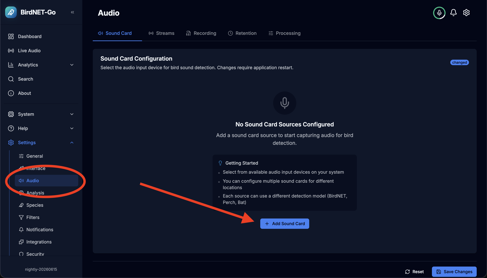
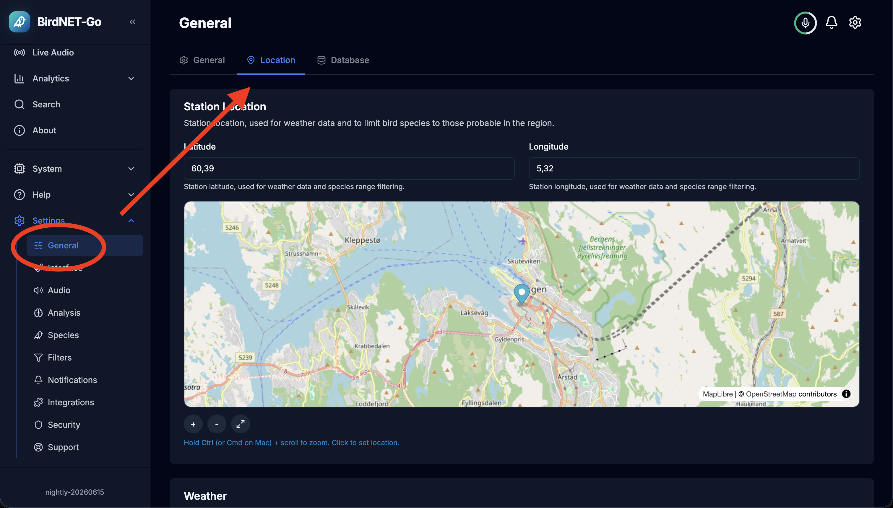

# Configuring BirdNET-Go

Birdnet go can be accessed from its web-dashboard at `http://<host>.local:8090`. This works well via your phone or computer, and will be acessible over your WiFi.

## Setting up the microphone (required)
> [!IMPORTANT]
> This step is required to get sound into the pi.

To get the sound up and running you must go to the BirdNET-Go dashboard at `http://<host>.local:8090`, navigate to settings/audio and add a new "Sound Card". Thats it! You can optionally tweak the audio source to "clean up" the sound. From my experience the inference can pick up bird songs even when there is quite a lot of background noise.

## Setting your location (strongly recommended)

To get the best experience you **should** set up your correct location, as this will affect what birds are likely in your area, and at the given time of year. 

## Avoiding false detections

I want to start off with saying that I think BirdNET-Go is a **fantastic** piece of software, however I feel like one of its shortcomings is the default detection configuration.

In my experience, the default BirdNET-Go config is so lax that some pretty wild detections will be made, e.g. a puffin being detected from a motorcycle passing by (anecdotal).

> [!NOTE]
> This project ships with what I believe to be a reasonable [initial standard config](https://github.com/arnegiacomo/fugleramme/blob/main/detector/config/config.yaml.template) that strikes a good balance between not being too strict and too lax. This will only apply on the first install, and will be configurable via BirdNET-Go's own dashboard (found at `http://<host>.local:8090`).

> [!IMPORTANT]
> I strongly recommend configuring this to your needs and desires, especially setting the correct map location.