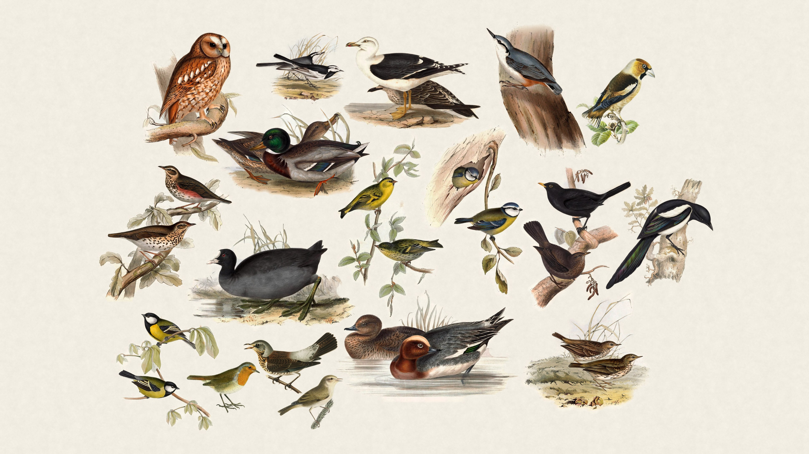
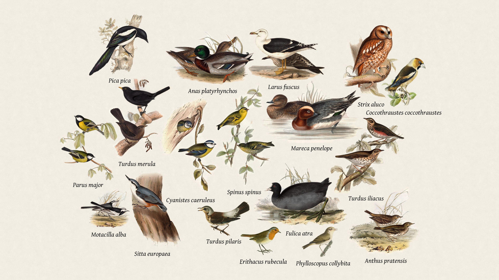
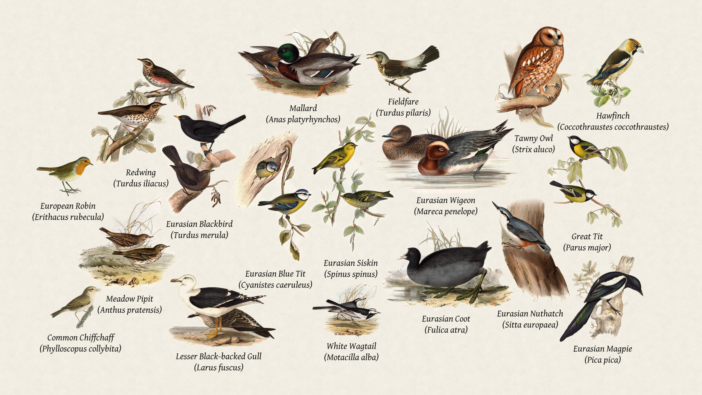
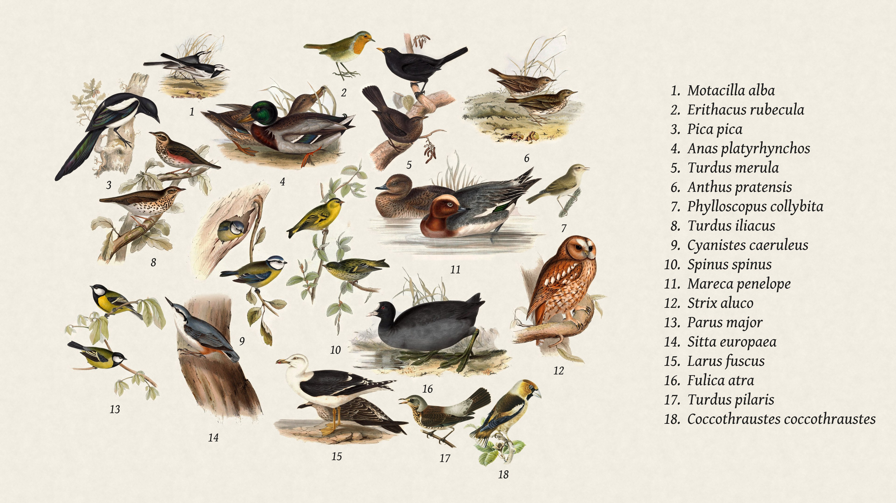
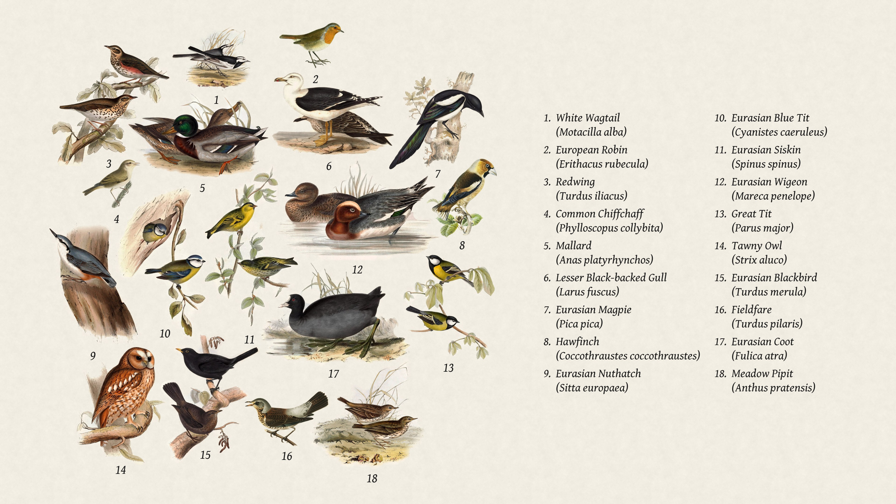
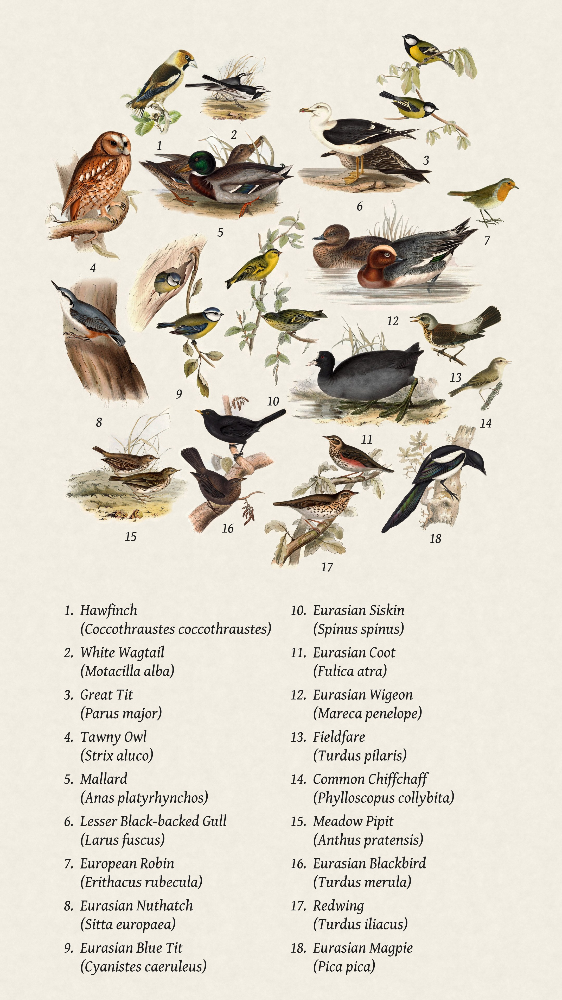

# Display

What the frame shows, and how to change it. Open the admin page at
`http://<host>.local:8080/admin` and use the **Display** tab.

## Modes

| Mode | What it shows |
| --- | --- |
| Collage (default) | Every bird heard in the lookback window, packed nicely together |
| Latest bird | The previous bird heard |
| Newest arrival | The most recent new bird heard |

Press **A** on the panel to step through the modes, or pick one in the admin page.

| Collage | Latest bird | Newest arrival |
| :---: | :---: | :---: |
|  |  |  |

**Newest arrival** stays put until something new is heard, so it can
sit on the same bird for weeks, but will update whenever a new species is observed.

**Latest bird** only changes when a different species is heard. The same bird
calling again all afternoon leaves the page alone. (Like "Newest arrival" but with repeats.)

Heard nothing at all in the lookback window? The page draws a bare perch.


## Settings

### Panel refresh

The shortest time the panel holds a render before newly heard birds may change it. Default is **As soon as it changes**. This is a floor and not a timer, and affects all modes. If you have a busy station, you can use this to avoid constant redraws.

### Resolution (web only)

The resolution of the web renders. Default is **1080p**. Independent from the e-ink panel's own size (automatically identified).

### Lock to panel (web only)

Lock the web view to the e-ink panel's shape and rotation. Default is **on** if you have an Inky Impression connected. Turn it off and pick an **Aspect** and **Portrait** to fit a TV or a desktop as well - see [Screens](screens.md). 

Without a panel there is nothing to lock to, and therefore the option is disabled.

### Margin

How much space between the birds and the edges, as a percentage of the short side. Default is **4%**. Raise it if your frame's passepartout covers the edge of the panel, so the birds don't end up under the cutout - see
[cutting the passepartout](hardware.md#cutting-the-passepartout-mostly-relevant-for-full-build).

The single-bird modes have a wide border, so only 8% or above affects them.

### Lookback window (collage only)

How far back the collage looks, from the last 15 minutes to all time. Default is
**Today (24 hours)**.

**All time** never drops a species, so the page only grows.

### Species on the page (collage only)

How many species the collage shows at once, and which it keeps when the window holds more than that. Default is **At most 40**. 

A busy installation can hear over thirty species in a day, and thirty birds on one sheet become very small. Set a limit and pick which to keep:

| Which ones to keep | Good for |
| --- | --- |
| The most heard | Most detections within a window |
| The rarest in the window | Least detections within a window |
| The rarest all time | Least detections ever recorded |

**Show all** means **all of them**. A long lookback at a busy station is yours to bound - past forty or so
the birds get small and the labels crowd (but at least you get a cool mosaic!).

**Only birds**, whatever the setting. BirdNET-Go's labels also cover frogs,
crickets and squirrels, and a bat model adds bats - the frame leaves all of it
out. They are still detected, and still on its own dashboard at `:8090`. The
log names each one the first time it is heard:

```bash
journalctl -u fugleramme-frame | grep "Not a bird"
```

### Layout (collage only)

How the birds are arranged on the page. Default is **Spiral**.

| Layout | What it does |
| --- | --- |
| Spiral | Big birds in the middle, small ones around them |
| Voids | Birds spread out to fill the whole sheet, corners included |

### Species names

**Show species names** turns the labels on and off, same as **B** on the panel.

Names come from BirdNET-Go, one dictionary per language. Pick a **primary
language** and optionally a second, which stacks underneath in parentheses. Only
downloaded dictionaries are offered - on a fresh install that may be the
scientific name alone.

**Typeface** and **size** apply to every label.

**Numbered key** (collage only) gives each bird a number and lists the names to the right in landscape, or below them in portrait, like a poster. (40 birds max, or whatever **Species on the page** is set to)

If the second language doesn't fit, as with many birds on the 7.3" panel, the list shows the first language only.

| No names | Names next to the birds | Two languages |
| :---: | :---: | :---: |
|  |  |  |

| Numbered key | Numbered key, two languages | Numbered key, tall page |
| :---: | :---: | :---: |
|  |  |  |
