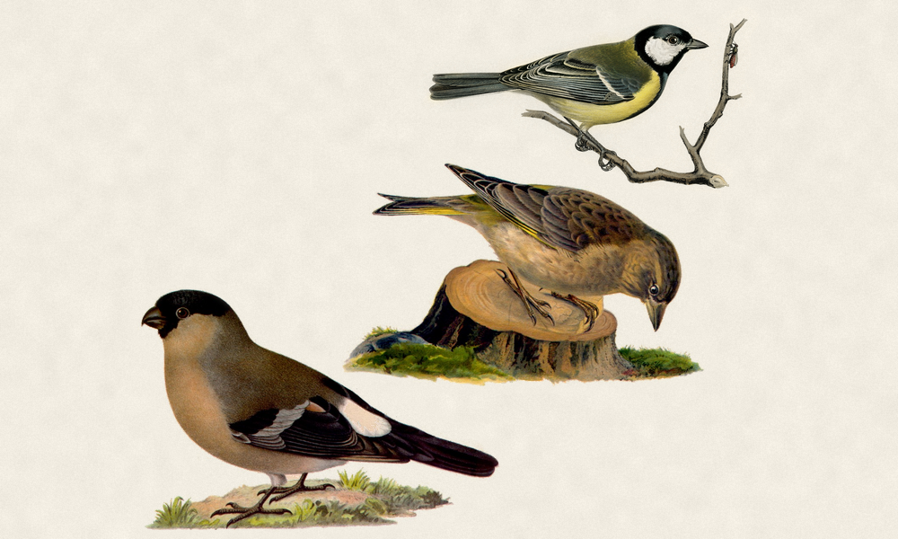

# Fugleramme

E-ink bird frame for Raspberry Pi - real-time bird detection by audio.

A USB mic feeds [BirdNET-Go](https://github.com/tphakala/birdnet-go), which runs
the BirdNET classifier and owns all detection config. Fugleramme reads its
detections and renders the recently-seen birds as a collage on an
[Inky Impression](https://shop.pimoroni.com/products/inky-impression) e-ink
panel, and serves the same view as a web kiosk.

| No detections | A few visitors | A full garden |
| :---: | :---: | :---: |
|  |  |  |

The birds are cut-outs from historic, public-domain natural-history drawings,
hand-curated for this project. Each detected species is matched to its
illustration and packed onto a textured paper page - larger birds toward the
centre, sized by real body mass.

## Docs

- **[Hardware](hardware.md)** - the parts, and what's swappable
- **[Install](install.md)** - from a blank SD card to a running frame
- **[Operations](operations.md)** - buttons, services, logs and updates
- **[Troubleshooting](troubleshooting.md)** - symptom to cause

Source: [github.com/arnegiacomo/fugleramme](https://github.com/arnegiacomo/fugleramme)
