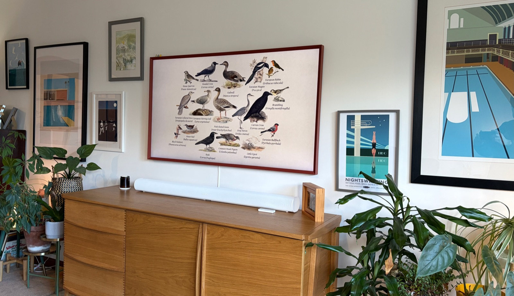
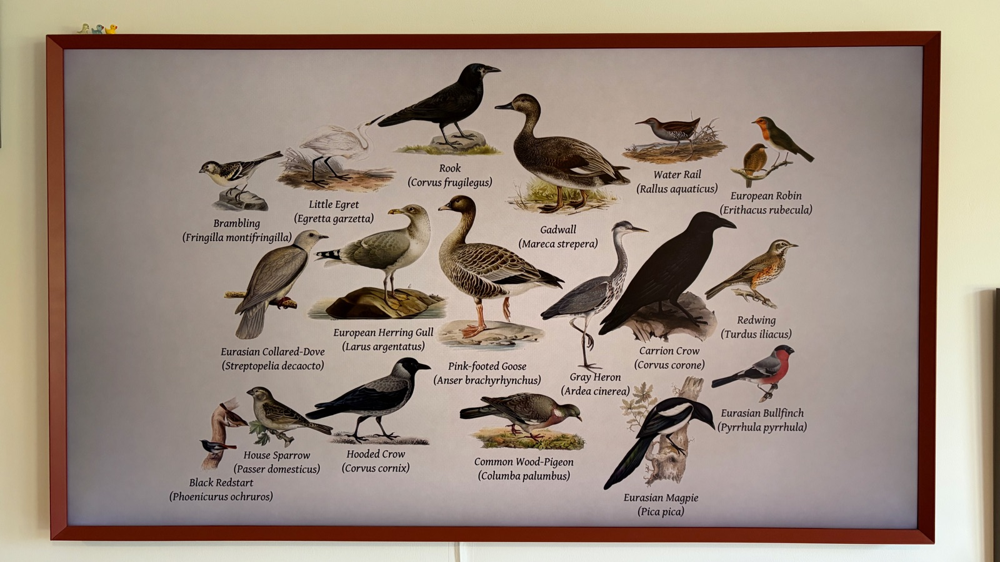

# Screens

Fugleramme serves the collage over HTTP, so it can show on more than the e-ink
panel. Four ways, easiest first.

## From another device

Open `http://<host>.local:8080/` on a phone, tablet or laptop on the same
network. This will work on any Raspberry pi os and installation method.

## On HDMI, Raspberry Pi OS Desktop

The desktop OS already has a browser and a session to run it in:

```bash
chromium --kiosk http://localhost:8080/
```

To start it with the desktop, add the same line to `~/.config/labwc/autostart`
(create the file if it isn't there):

```bash
chromium --kiosk http://localhost:8080/ &
```

> [!NOTE]
> The package is `chromium` on Trixie. Older guides say `chromium-browser`,
> which is now an empty package that pulls in `chromium` anyway.

## On HDMI, Raspberry Pi OS Lite

Lite has no browser **and no display server**, so installing `chromium` on its
own is not enough. It needs a compositor and a
session too. [`cage`](https://www.hjdskes.nl/projects/cage/) is the smallest one
that will do: it runs a single app fullscreen and has nothing to configure.

```bash
ssh <user>@<host>.local
sudo apt install --no-install-recommends chromium cage
```

Then a service, so it comes up with the Pi. `PAMName` and `TTYPath` are what
give the browser a login session and a seat on the screen, which is the part
that is missing on Lite:

```bash
sudo tee /etc/systemd/system/fugleramme-kiosk.service <<'EOF'
[Unit]
Description=Fugleramme HDMI kiosk
After=systemd-user-sessions.service getty@tty1.service fugleramme-frame.service
Conflicts=getty@tty1.service

[Service]
User=<user>
PAMName=login
TTYPath=/dev/tty1
TTYReset=yes
TTYVHangup=yes
StandardInput=tty-force
Environment=XDG_RUNTIME_DIR=/run/user/%U
ExecStart=/usr/bin/cage -- /usr/bin/chromium --kiosk --ozone-platform=wayland --noerrdialogs --disable-infobars http://localhost:8080/
Restart=always
RestartSec=5

[Install]
WantedBy=multi-user.target
EOF

sudo systemctl daemon-reload
sudo systemctl disable getty@tty1.service
sudo systemctl enable --now fugleramme-kiosk
```

Replace `<user>` with your username, and `8080` with `FRAME_PORT` if you changed
it.

Disabling `getty@tty1` is not optional. Without it the login prompt and the
kiosk are both pulled in by the same boot transaction, systemd drops one of the
two conflicting jobs, and often it is the kiosk - which starts fine by hand and
then doesn't come back after a reboot.

> [!IMPORTANT]
> This gives up the login prompt on the attached screen, so SSH becomes the only
> way in. `sudo systemctl enable getty@tty1.service` puts it back.

Logs, when it doesn't come up:

```bash
journalctl -u fugleramme-kiosk -f
```

> [!NOTE]
> A portrait screen is rotated by the display, not by the frame. The
> **Rotation** setting on the admin page changes the shape of the page, and only
> the e-ink panel turns its own pixels; for HDMI, rotate the output in
> `/boot/firmware/cmdline.txt` (e.g. `video=HDMI-A-1:1920x1080@60,rotate=90`).

## On a Samsung Frame TV

Courtesy of Conrad Jackson ([@conradj](https://github.com/conradj)):
[fugleramme-samsung-frame](https://github.com/conradj/fugleramme-samsung-frame)
sends the collage to a Samsung Frame TV while it is in Art Mode. It runs next
to the frame and checks for a new collage every 15 minutes. Setup is in that
repo's README.





Photos by Conrad Jackson, from
[Fugleramme for Samsung Frame TV](https://github.com/arnegiacomo/fugleramme/discussions/145).
