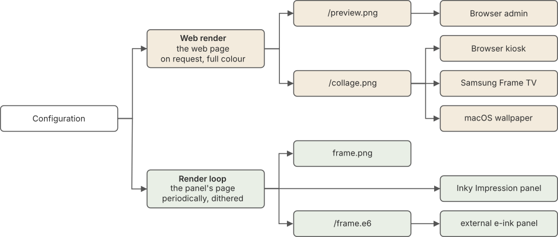
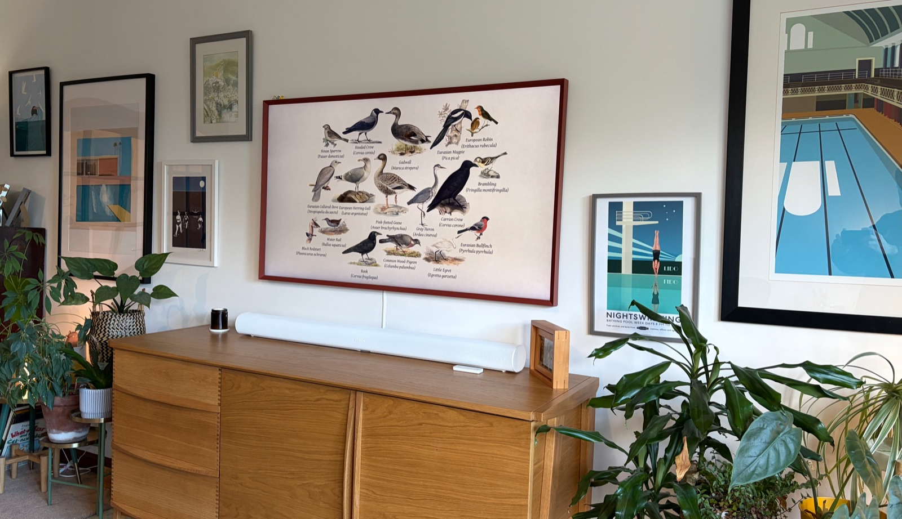
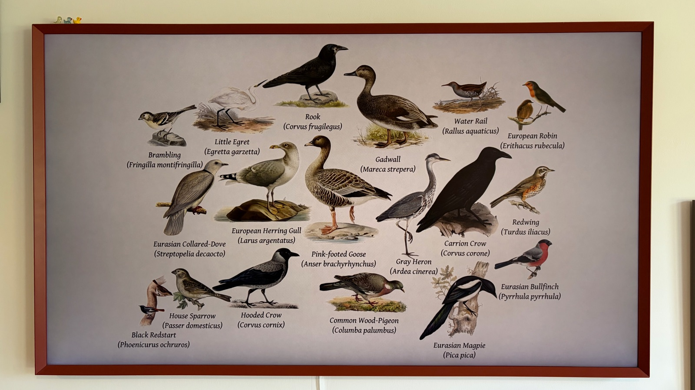
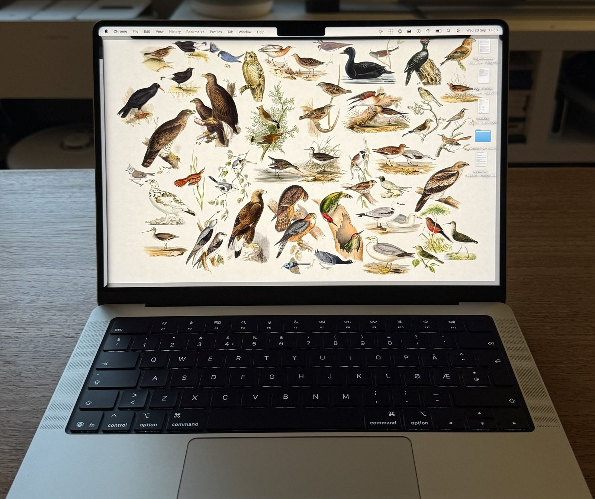
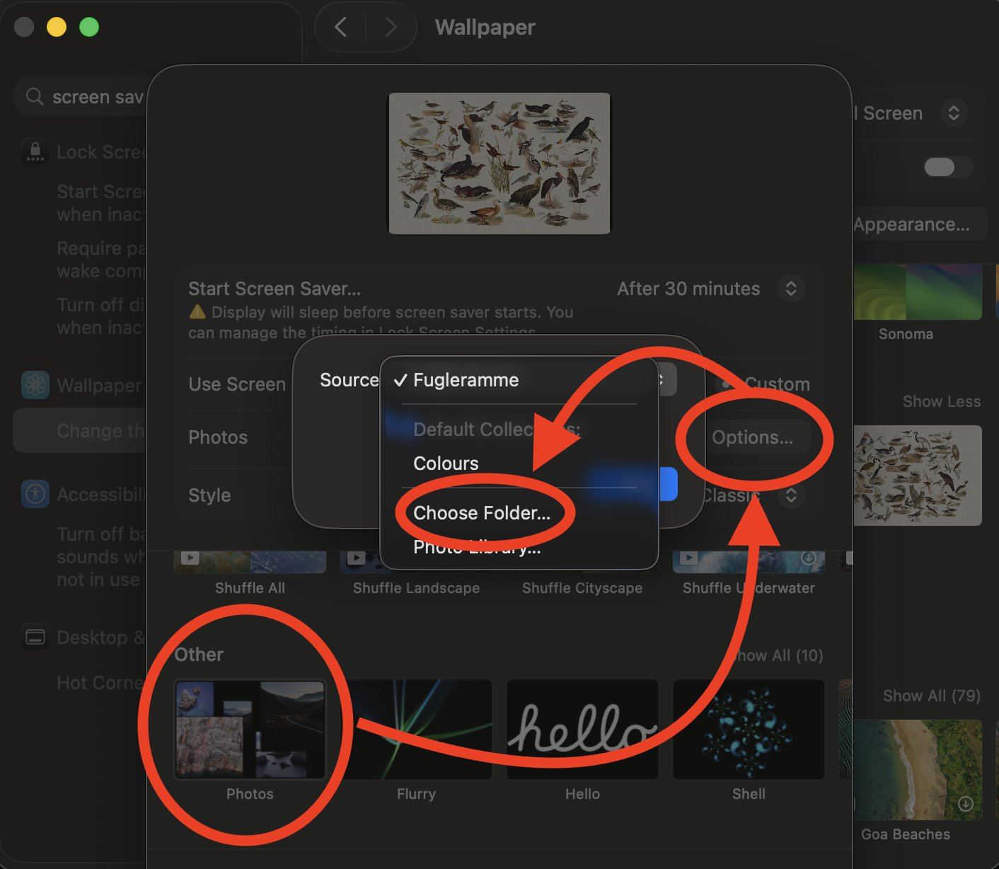
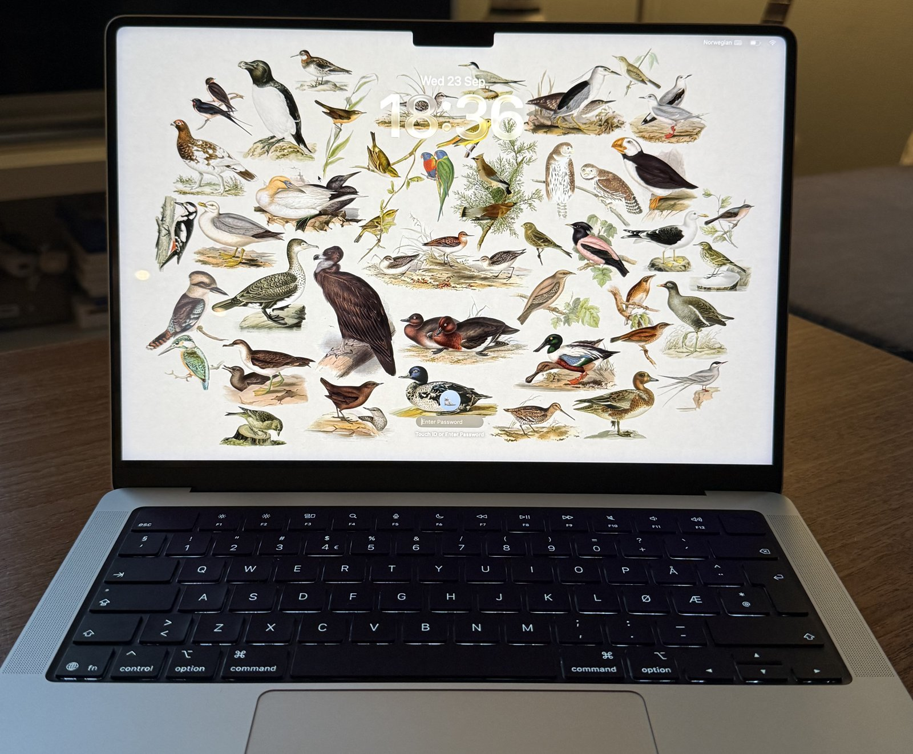

# Screens

Fugleramme serves the collage over HTTP, so it can show on more than the e-ink
panel.

## Two pictures

The frame draws two pictures of the same birds, with the same mode, style and
names:

- **The panel's page** is what the e-ink panel shows. It is dithered to the
  panel's six inks, on plain paper, at the panel's own size and **Rotation**.
  New birds change it at most as often as **Panel refresh** allows, and it
  stays up while BirdNET-Go is unreachable.
- **The web page**, at `/collage.png`, is in full colour on textured paper, at
  the size you pick under **Resolution**. With **Lock to panel** on it has the
  panel's shape, otherwise its own **Aspect**. It is drawn whenever something
  asks for it, so new birds show up straight away.

The preview on the admin page is the panel's page in full colour, with any
changes you have not saved yet. Without a panel it shows the web page.



Six ways to show them, easiest first.

## From another device

Open `http://<host>.local:8080/` on a phone, tablet or laptop on the same
network. This will work on any Raspberry pi os and installation method.

## On HDMI, Raspberry Pi OS Desktop

The desktop OS already has a browser and a session to run it in:

```bash
chromium --kiosk http://localhost:8080/
```

To start it with the desktop, add the same line to `~/.config/labwc/autostart`
(create the file if it isn't there):

```bash
chromium --kiosk http://localhost:8080/ &
```

> [!NOTE]
> The package is `chromium` on Trixie. Older guides say `chromium-browser`,
> which is now an empty package that pulls in `chromium` anyway.

## On HDMI, Raspberry Pi OS Lite

Lite has no browser **and no display server**, so installing `chromium` on its
own is not enough. It needs a compositor and a
session too. [`cage`](https://www.hjdskes.nl/projects/cage/) is the smallest one
that will do: it runs a single app fullscreen and has nothing to configure.

```bash
ssh <user>@<host>.local
sudo apt install --no-install-recommends chromium cage
```

Then a service, so it comes up with the Pi. `PAMName` and `TTYPath` are what
give the browser a login session and a seat on the screen, which is the part
that is missing on Lite:

```bash
sudo tee /etc/systemd/system/fugleramme-kiosk.service <<'EOF'
[Unit]
Description=Fugleramme HDMI kiosk
After=systemd-user-sessions.service getty@tty1.service fugleramme-frame.service
Conflicts=getty@tty1.service

[Service]
User=<user>
PAMName=login
TTYPath=/dev/tty1
TTYReset=yes
TTYVHangup=yes
StandardInput=tty-force
Environment=XDG_RUNTIME_DIR=/run/user/%U
ExecStart=/usr/bin/cage -- /usr/bin/chromium --kiosk --ozone-platform=wayland --noerrdialogs --disable-infobars http://localhost:8080/
Restart=always
RestartSec=5

[Install]
WantedBy=multi-user.target
EOF

sudo systemctl daemon-reload
sudo systemctl disable getty@tty1.service
sudo systemctl enable --now fugleramme-kiosk
```

Replace `<user>` with your username, and `8080` with `FRAME_PORT` if you changed
it.

Disabling `getty@tty1` is not optional. Without it the login prompt and the
kiosk are both pulled in by the same boot transaction, systemd drops one of the
two conflicting jobs, and often it is the kiosk - which starts fine by hand and
then doesn't come back after a reboot.

> [!IMPORTANT]
> This gives up the login prompt on the attached screen, so SSH becomes the only
> way in. `sudo systemctl enable getty@tty1.service` puts it back.

Logs, when it doesn't come up:

```bash
journalctl -u fugleramme-kiosk -f
```

> [!NOTE]
> A portrait screen is rotated by the display, not by the frame. The
> **Rotation** setting on the admin page changes the shape of the page, or
> **Portrait** does with **Lock to panel** off, and only the e-ink panel turns
> its own pixels; for HDMI, rotate the output in
> `/boot/firmware/cmdline.txt` (e.g. `video=HDMI-A-1:1920x1080@60,rotate=90`).

## On a Samsung Frame TV

Courtesy of Conrad Jackson ([@conradj](https://github.com/conradj)):
[fugleramme-samsung-frame](https://github.com/conradj/fugleramme-samsung-frame)
sends the collage to a Samsung Frame TV while it is in Art Mode. It runs next
to the frame and checks for a new collage every 15 minutes. Setup is in that
repo's README.

The TV only offers its own mats when the picture is exactly its size. For
that, turn off **Lock to panel** on the admin page and set **Resolution** to 4K
and **Aspect** to 16:9. Set [Margin](frame.md#margin) to 0 too, since the TV
adds its own mat - with an e-ink panel beside it, turn off **Uniform** first, so the panel keeps its own margin.





Photos by Conrad Jackson, from
[Fugleramme for Samsung Frame TV](https://github.com/arnegiacomo/fugleramme/discussions/145).

## On an external e-ink panel

An e-ink panel driven by a microcontroller instead of a Pi (e.g.
[Seeed Studio's 13.3" Spectra 6 panel](https://www.seeedstudio.com/13-3inch-Six-Color-eInk-ePaper-Display-with-1200x1600-Pixels-p-6569.html)
on a
[XIAO EE02](https://www.seeedstudio.com/XIAO-ePaper-Display-Board-ESP32-S3-EE02-p-6639.html))
runs from a battery and can hang anywhere in Wi-Fi range, fetching the page
from a Fugleramme running elsewhere. Enable **External e-ink panel** on the
admin page, under **Frame**. Fugleramme then serves the panel's page, already
dithered and packed for the panel, at `http://<host>.local:8080/frame.e6`, so
the microcontroller does not have to decode an image. Without an Inky
connected, the page is laid out for the 13.3" panel, so **Rotation**,
**Margin** and **Panel refresh** all apply to it. With an Inky connected, the
external panel gets the Inky's page.

> [!IMPORTANT]
> Like the kiosk, `/frame.e6` needs no sign-in: anyone who can reach the
> frame can read it.

[`examples/ee02/main.py`](https://github.com/arnegiacomo/fugleramme/blob/main/examples/ee02/main.py)
is a MicroPython program for the XIAO EE02. It wakes for the interval the
page's header carries in its **Panel refresh** setting. So a 10 minute setting
has it fetch every 10 minutes, and it never fetches more often than its own 5
minute floor, even when **Panel refresh** is off. It downloads the page only
if it has changed, and redraws the panel only once the download checks out. If
something goes wrong, it writes an error message on the panel instead.

The program drives the 13.3" panel only, and the page is packed for that
panel's two controllers. Running a smaller panel or another board? A program
for it, and the packing it needs, would make a welcome contribution - see
[Contributing](https://github.com/arnegiacomo/fugleramme/blob/main/CONTRIBUTING.md).

1. Install MicroPython on the board (e.g.
   [for the XIAO EE02](https://micropython.org/download/SEEED_XIAO_ESP32S3/))
2. Set your Wi-Fi credentials and Fugleramme host at the top of `main.py`
3. Upload `main.py` to the board (e.g. with
   [mpremote](https://docs.micropython.org/en/latest/reference/mpremote.html))

### E6 File Format

The E6 file format is not an official standard. It simply consists of a stream
of ink values, one pixel at a time. Upon request, a microcontroller downloads
the stream and uses it directly to program its connected e-ink panel.

To avoid programming corrupted data or pixels laid out for a different screen
size (i.e., when the configuration does not match the e-ink panel), a header
with all relevant configuration details is sent ahead of the payload. If the
header's configuration does not match the microcontroller's, the payload is
discarded.

The header is 20 bytes long, little-endian, and is followed directly by the
pixel data.

| Offset | Size | Field |
| --- | --- | --- |
| 0 | 4 | `E6F1` |
| 4 | 2 | Version, `1` |
| 6 | 1 | Encoding, `1` (the colour codes below) |
| 7 | 1 | Poll minutes, from **Panel refresh** |
| 8 | 2 | Width, `1200` |
| 10 | 2 | Height, `1600` |
| 12 | 4 | Length of the pixels, `960000` |
| 16 | 4 | CRC-32 of the pixels |

The pixels are already oriented the way the panel's controllers read them, so
a client only needs to stream them. Two pixels to a byte, the left one in the
high half; black `0`, white `1`, yellow `2`, red `3`, blue `5`, green `6`. The
panel has two controllers, one per half: the first 480000 bytes are the left
half of every row, top to bottom, for the first controller, and the rest are
the right halves for the second. With a different Inky connected, the file
carries that panel's page, which its width and height reveal, so check them.

The response carries an `ETag`; send it back as `If-None-Match` and an
unchanged page responds with `304` and nothing to download. `404` means the
setting is off, and `503` that the frame has not drawn a page yet.

## As a desktop wallpaper and/or screensaver (MacOs)

Turn off **Lock to panel** on the admin page and
set **Resolution** and **Aspect** to match your screen, then:

```bash
curl -fsSL https://raw.githubusercontent.com/arnegiacomo/fugleramme/main/examples/wallpaper-macos.sh | sh -s -- http://<your-fugleramme-address>:8080
```

Add `--every x` after the address to fetch every x minutes (default 15).
The five last rendered pages stay in `~/Pictures/Fugleramme`.



For the screen saver, open System Settings, Screen Saver, set **Use Screen Saver** to Custom and pick **Photos** under Other. Under **Options**, choose the Fugleramme-folder as the source. The screen saver reads the folder when it starts and will shuffle between the 5 last renders.




It should look something like:
<video src="../assets/macos-screen-saver.mp4" autoplay loop muted playsinline width="360" aria-label="The screen saver crossfading from one collage to the next on a MacBook"></video>

Not set fugleramme up yourself yet? Point it at a demo, `https://fugleramme.arnegiacomo.dev` or any [showcase](showcase.md) address.

Run this to disable:
```Bash
sh examples/wallpaper-macos.sh --remove
```

